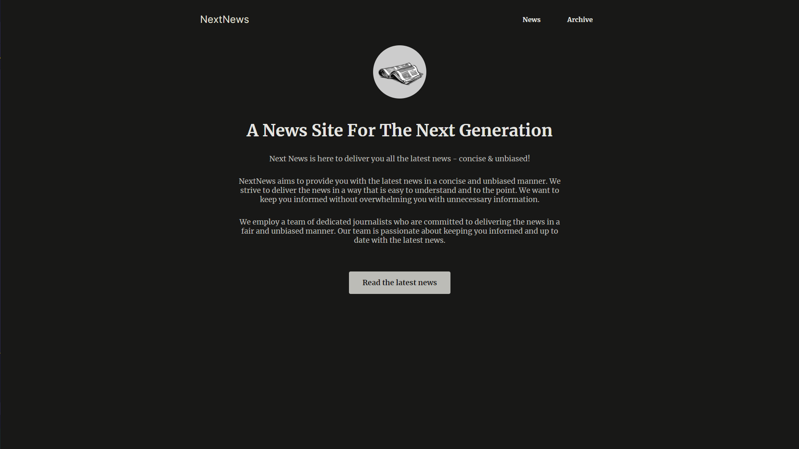

NextNews

NextNews is a news site developed using Next.js, designed to deliver concise and unbiased news. This project demonstrates the use of various routing systems and data fetching techniques, both from the backend and directly from the database.

Features
Next.js: Utilizes the Next.js framework for server-side rendering and static site generation.
Database: Uses SQLite for managing the news articles and other data.
Routing Systems: Implements parallel routing and route intercepting to enhance navigation.
Data Fetching: Demonstrates methods for fetching data from the backend and directly from the database.
Project Setup
To get the project up and running, follow these steps:

Clone the Repository:

bash
Kodu kopyala
git clone https://github.com/yourusername/nextnews.git
cd nextnews
Install Dependencies:

bash
Kodu kopyala
npm install
Setup the Database:
Ensure you have SQLite installed on your machine. Create a database file and run the necessary migrations to set up the schema.

bash
Kodu kopyala
sqlite3 news.db < schema.sql
Environment Variables:
Create a .env.local file and add your environment-specific variables:

env
Kodu kopyala
DATABASE_URL=sqlite://news.db
Run the Development Server:

bash
Kodu kopyala
npm run dev
Open http://localhost:3000 with your browser to see the result.

Usage
Navigation: Use the top navigation links to switch between the latest news and the archive.
Read Articles: Click on "Read the latest news" to view the newest articles.
Data Fetching
The project illustrates two primary methods of data fetching:

From Backend: Fetch data via API routes defined in the backend.
Direct Database Access: Access data directly from the SQLite database.
These methods ensure that the application remains performant and scalable.
